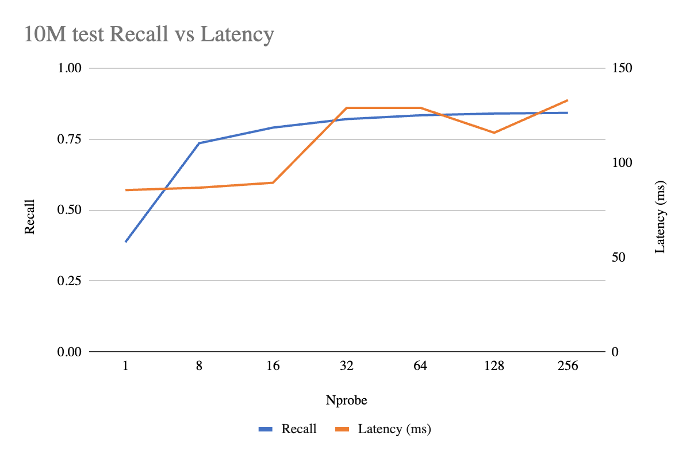
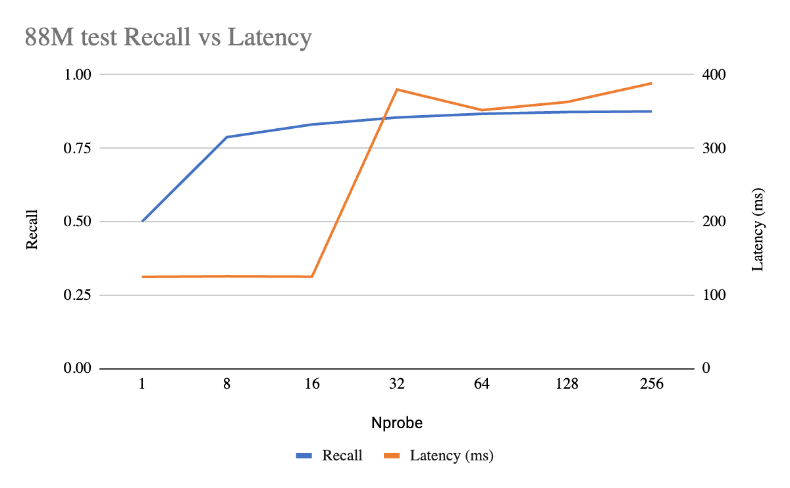

# Scaling 88 Million Vectors on Modest Hardware: How MatrixOne Leverages cuVS for Extreme IVF Performance

As AI applications proliferate, efficient vector search at scale has moved from a "nice-to-have" to a core database requirement. At MatrixOrigin, we recently faced a significant engineering challenge: **How do we build and search an IVF index over tens of millions of high-dimensional vectors without renting an entire data center?**

For our benchmarks we used NVIDIA's open **`wiki_all` dataset** (768-dimensional vectors derived from Wikipedia passage embeddings), scaling up to **88 million vectors**. Traditional CPU-based approaches were hitting a wall: index builds took hours — sometimes days — and search latency was inconsistent under concurrency. By integrating NVIDIA's **cuVS** and **RAFT** libraries into our architecture, we transformed our performance profile. Here is the step-by-step story of how we did it, and the head-to-head numbers that prove it.

## The Challenge: The "Giant Index" Problem

Our target was an IVF index with thousands of clusters holding tens of millions of 768-D vectors. On modest CPU hardware we encountered three primary bottlenecks:

1. **Clustering Latency**: Standard K-Means was slow and often produced unbalanced clusters, leading to "hotspots" that slowed down search.
2. **Assignment Overhead**: Mapping 50M+ vectors to their nearest centroids is computationally expensive. On CPUs, this task competed for resources with data loading and decompression, dragging the process out to a full day.
3. **The GPU "Single Query" Trap**: Databases typically process one query at a time. GPUs, however, only show their true strength when processing large batches.
4. **Filtered Search Penalty**: Real SQL workloads rarely query a vector index in isolation — they look like *"top-10 nearest passages **where `file_id = X`**"*. The straightforward implementation is **file-based filtering**: for every incoming query, re-read the filter columns from object storage to evaluate the predicate. At tens of millions of rows, that turns each query into a storage-bound job — disk/network I/O dominates and GPU search throughput collapses long before the index itself is the bottleneck. Compounding this, the "search first, filter later" pattern wastes GPU cycles ranking rows the predicate will discard and forces deeper `nprobe` sweeps to refill `top-k` after filtering.

## Hardware & Methodology

Before walking through the engineering, here is the explicit setup so the numbers later in the post have context. The headline is that this is **modest, off-the-shelf hardware** — one or eight commodity GPUs on stock AWS instances, not a custom training cluster.

**Hardware (all benchmarks run on AWS `g6e`, NVIDIA L40S):**

| | CPU baseline (IVF-Flat search) | GPU (IVF-PQ, 1M / 10M) | GPU (IVF-PQ, 88M) |
|---|---|---|---|
| AWS instance | `g6e.16xlarge` | `g6e.12xlarge` | `g6e.48xlarge` |
| vCPU / host RAM | 64 vCPU / 512 GB | 48 vCPU / 384 GB | 192 vCPU / 1536 GB |
| GPU | 1× L40S (48 GB) — *build only* | 1× L40S (48 GB) | 8× L40S (sharded) |
| Search runs on | **CPU** | **GPU** | **GPU** |

For every IVF-Flat search number we report, **search runs on the CPU** even when the index was *built* on the GPU — that is the apples-to-apples "CPU search" baseline against which the GPU IVF-PQ numbers should be read. IVF-PQ runs **end-to-end on the GPU**.

## Step 1: Solving Clustering with Balanced K-Means

Standard K-Means often results in some clusters having thousands of vectors while others have almost none. In an IVF index, this leads to unpredictable IO and search times.

We initially implemented our own balanced K-Means, which brought clustering time down from 30 minutes to 5 minutes. By switching to the **cuVS Balanced K-Means algorithm**, we tapped into full GPU parallelism.

* **Result**: Clustering time dropped from **5 minutes to just 5 seconds**.

## Step 2: Offloading Assignment to Brute-Force GPU Kernels

Once the centroids are defined, every vector must be assigned to its closest cluster. Doing this on a 16-core CPU is a nightmare of cache misses and thread contention.

By using the **cuVS Brute-Force index** to offload distance computation to the GPU, we eliminated the CPU bottleneck entirely.

* **Result**: The assignment phase dropped from **24 hours to 30 minutes**.

## Step 3: The Architecture — `cuvs_worker_t` and Dynamic Batching

To solve the "Single Query" problem, we designed a bridge between Go and CUDA: the `cuvs_worker_t`.

### Dynamic Batching: The Secret Sauce

Instead of launching a new CUDA kernel for every incoming request, our worker implements **Dynamic Batching**. It holds incoming queries for a tiny microsecond window, consolidates them into a single matrix, and executes one large GPU search.

* This maximizes warp utilization and reduces kernel launch overhead.
* **Performance Gain**: Provides a **5x–10x throughput boost** in high-concurrency environments.

### RAFT Resource Management

We leverage the **RAFT** library to manage long-lived `raft::resources`. By caching CUDA streams and handles within persistent C++ threads, we ensure that our Go-based engine can interact with the GPU with near-zero per-request initialization overhead.

## Step 4: Staying Within Memory Budget with Auto-Quantization

50M+ 768-D vectors in `float32` require well over 100 GB — far exceeding a typical RAM budget. To solve this, we implemented **Automatic Type Quantization** directly on the GPU using the cuVS quantization library.

* **FP16 (Half Precision)**: Reduces memory by 2x with almost zero recall loss.
* **8-Bit Integer (int8/uint8)**: Uses a learned Scalar Quantizer to compress vectors by 4x.
* Because conversion happens on the GPU, we avoid taxing the CPU and minimize PCIe bus traffic.

## Step 5: Pushing SQL Predicates Down — Filtered Search Inside cuVS

A vector index is rarely queried in isolation. Real workloads look like *"find the top-10 nearest passages **where `file_id = X`**"*. The naive approach — search first, filter later — wastes GPU cycles ranking candidates that the optimizer is about to throw away, and forces deep `nprobe` sweeps just to backfill `top-k` after filtering.

cuVS supports **pre-filtering via a predicate bitset**, and we wired it directly into the MatrixOne query pipeline:

1. We keep the **filter columns resident in RAM** (e.g., `file_id`, score columns referenced by predicates), avoiding per-query disk reads.
2. The SQL planner extracts the predicate (e.g., `file_id = 20000007`) and the **CPU computes a packed bitset** in RAM — 1 bit per indexed vector — by scanning the in-RAM column. This is dramatically cheaper than the alternative of file-based filtering, where each query would re-read the column from storage.
3. The bitset is handed to cuVS, which consults it during graph traversal / list scanning so the GPU skips disqualified vectors before distance computation.
4. The CAGRA / IVF-PQ kernel returns only `top-k` results that already satisfy the predicate — no post-hoc reranking pass.

The bitset itself stays in host RAM; only the index data lives on the GPU. The combination — RAM-resident filter columns plus CPU-computed bitsets driving GPU pre-filtering — sidesteps both disk I/O and wasted GPU work. The 88M numbers below show the payoff concretely: under SQL pre-filtering, GPU-enhanced IVF-Flat (which has to filter on the CPU *after* search) drops to **~3 QPS at recall 0.80** and tops out at ~12 QPS at lower recall, while pure-GPU IVF-PQ with bitset pre-filtering holds **~80–98 QPS** across `nprobe`.

## Head-to-Head: CPU IVF-Flat vs. GPU-Enhanced IVF-Flat vs. Pure-GPU IVF-PQ

To quantify the value of pushing *both build and search* onto the GPU (IVF-PQ) versus only accelerating the build pipeline (IVF-Flat with CPU-side search), we benchmarked both on AWS `g6e` instances using NVIDIA L40S GPUs across three scales of the `wiki_all` dataset (1M, 10M, 88M @ 768-D, top-10, concurrency = 100, n = 10000 queries).

### Parameter Tuning: How We Chose `nprobe` and `pq_bits`

Before showing the head-to-head numbers, it's worth explaining how the parameters in those tables were picked. Two questions need answers for each index family: *how do we pick `nprobe`*, and (for IVF-PQ) *how aggressive can the quantization be*? We tuned on the 10M slice — large enough to be representative, cheap enough to sweep — targeting **recall ≈ 0.80 @ top-10**, then validated the chosen setting at 88M.

#### IVF-PQ: `pq_bits = 8`, `nprobe = 16`

We ran a Pareto sweep over `nprobe ∈ {1, 8, 16, 32, 64, 128, 256}`:

The curve shows a classic IVF knee: recall climbs steeply until `nprobe = 16` (0.79), then flattens — beyond that, each doubling of `nprobe` adds at most ~1 point of recall but latency starts to drift up. **`nprobe = 16` is the Pareto-optimal point** for our 0.80 recall target.

Next, can more aggressive PQ compression hold that target? We swept `pq_bits ∈ {8, 7, 6}` at the same `nprobe` ladder (10M, top-10, concurrency=100, n=10000):

| `nprobe` | `pq_bits=8` Recall | `pq_bits=7` Recall | `pq_bits=6` Recall |
|---|---|---|---|
| 1   | 0.39 | 0.38 | 0.37 |
| 8   | 0.74 | 0.71 | 0.68 |
| **16**  | **0.79** | 0.76 | 0.72 |
| 32  | 0.82 | 0.79 | 0.74 |
| 64  | 0.83 | 0.80 | 0.75 |
| 128 | 0.84 | 0.81 | 0.76 |
| 256 | 0.84 | 0.81 | 0.76 |

Only `pq_bits = 8` clears 0.80 at `nprobe = 16`. `pq_bits = 7` needs `nprobe ≥ 64` to get there (4× more probes for the same recall), and `pq_bits = 6` never reaches 0.80 in this sweep — its asymptotic ceiling is ~0.76. Since dropping from 8 → 7 bits saves only ~12% on stored vector bytes, trading recall headroom for a fractional storage win is the wrong call.

We then validated at 88M:

The 88M curve shows the same knee: recall hits 0.83 at `nprobe = 16` (~125 ms), and only creeps to 0.88 by `nprobe = 256` — but latency triples to ~380 ms once `nprobe ≥ 32`, where the per-probe cost stops fitting in the device-memory working set. The 10M-tuned setting (`pq_bits = 8, nprobe = 16`) holds at scale, which is the whole point of doing the Pareto on the smaller dataset.

#### IVF-Flat: `lists = 10000`, `nprobe = 8` to match the recall target

IVF-Flat has no quantization knob — vectors are stored uncompressed in `float32` — so the only tunables are cluster count (`lists`) and `nprobe`. We set `lists = 10000` for the 88M index (≈ √N, the standard heuristic) and tuned `nprobe` to hit the same recall target as IVF-PQ (~0.8 @ top-10). On the 10M slice this lands at **`nprobe = 8`** (recall 0.82) — half the probes IVF-PQ needs for the same recall, since IVF-Flat keeps full-precision vectors. We use the same setting at 88M and report two higher points to span the curve:

| `nprobe` | Recall@10 | QPS |
|---|---|---|
| **8**   | **0.70** | **22** |
| 16  | 0.91 | 10 |
| 32  | 0.96 | 4  |

(88M `wiki_all`, no filter, top-10, concurrency=100, n=10000.)

Unlike IVF-PQ there is no flat region: every additional probe pulls more cluster pages off disk — the 270 GB raw dataset doesn't fit in the ~256 GB usable cache (see the cache-miss analysis below) — so QPS roughly halves at each step. At 88M the recall target slips: `nprobe = 8` matches IVF-PQ at smaller scales but only reaches 0.70 recall here, because each cluster gets fewer probes relative to the index size. Pushing `nprobe` higher recovers recall but at a steep QPS cost — there is no sweet spot, only a recall-vs-throughput dial. The head-to-head below uses `nprobe ∈ {8, 16, 32}` for IVF-Flat to span the full curve.

### Build Time

| Dataset | IVF-Flat (CPU build) | IVF-Flat (GPU build, CPU search) | IVF-PQ (Pure GPU) | Speedup (CPU vs IVF-PQ) |
|---|---|---|---|---|
| 1M | 58 s | 29 s | 45 s | 1.3x |
| 10M | 19 min | 4 min 26s | 4 min 21 s | 4.4x |
| **88M** | **4 h 8 min** | **62 min** | **1 h 12 min** | **~3.4x** |

At small scale, IVF-Flat's simpler build wins. At **88M vectors, IVF-Flat (GPU) and IVF-PQ builds are ~3-4× faster than the CPU build** — turning an overnight job into a coffee break.

### Search Throughput (no filter, top-10)

**Recall-matched headline** — IVF-Flat `nprobe=8` vs IVF-PQ `nprobe=16`, both tuned to land near the same recall target (~0.8 on the 10M slice):

| Dataset | IVF-Flat (`nprobe=8`) | IVF-PQ (`nprobe=16`) | IVF-PQ vs IVF-Flat |
|---|---|---|---|
| 1M | 768 QPS, recall 0.86 | 904 QPS, recall 0.82 | 1.2× |
| 10M | 491 QPS, recall 0.82 | 1066 QPS, recall 0.79 | 2.2× |
| **88M** | **22 QPS, recall 0.70** | **759 QPS, recall 0.83** | **~35×** |

**Full `nprobe` sweep** — same setup, each index across `nprobe ∈ {8, 16, 32}`:

| Dataset | Nprobe | IVF-Flat Recall | IVF-Flat QPS | IVF-PQ Recall | IVF-PQ QPS |
|---|---|---|---|---|---|
| 1M | 8 | 0.86 | 768 | 0.78 | 1060 |
| 1M | 16 | 0.93 | 937 | 0.82 | 904 |
| 1M | 32 | 0.99 | 384 | 0.84 | 889 |
| 10M | 8 | 0.82 | 491 | 0.74 | 1099 |
| 10M | 16 | 0.90 | 408 | 0.79 | 1066 |
| 10M | 32 | 0.95 | 243 | 0.82 | 756 |
| 88M | 8 | 0.70 | 22 | 0.79 | 776 |
| 88M | 16 | 0.91 | 10 | 0.83 | 759 |
| 88M | 32 | 0.96 | 4 | 0.85 | 260 |

### Search Throughput Under SQL Pre-Filter (88M, top-10)

| Nprobe | IVF-Flat Recall | IVF-Flat QPS | IVF-PQ Recall | IVF-PQ QPS |
|---|---|---|---|---|
| 8 | 0.61 | 11.9 | 0.69 | **98.0** |
| 16 | 0.76 | 12 | 0.77 | 98.0 |
| 32 | 0.80 | 3 | 0.81 | 80 |

This is the bitset pre-filtering payoff: IVF-PQ holds **~80–98 QPS** across `nprobe` while IVF-Flat must push `nprobe` up to recover the recall it loses to post-search filtering — and pays for it. At the matched-recall setting (~0.80, `nprobe=32` for IVF-Flat vs `nprobe=32` for IVF-PQ), pure-GPU IVF-PQ delivers **~27× higher QPS** because the GPU never spends a cycle on rows the SQL predicate already rejected.

### What the Numbers Tell Us

* **At 88M vectors and recall ~0.8, pure-GPU IVF-PQ is ~35× faster than GPU-enhanced IVF-Flat** (759 QPS @ `nprobe=16`, recall 0.83 vs 22 QPS @ `nprobe=8`, recall 0.70), and the gap widens dramatically as IVF-Flat is pushed for higher recall — reaching **~75×** at `nprobe=16` (759 vs 10 QPS) and **~65×** at `nprobe=32` (260 vs 4 QPS) — because each additional probe sends IVF-Flat further into uncached cluster pages on disk (see cache-miss analysis below).
* **Recall stability**: IVF-PQ recall climbs gently with `nprobe` (0.79 → 0.85 from 8 to 32 at 88M), while IVF-Flat must work much harder for the same gain (0.70 → 0.96) and pays a 5× QPS penalty doing it. That makes IVF-PQ much easier to tune for production SLOs.
* **Filtered queries are where IVF-Flat collapses**: with bitset pre-filtering inside cuVS, IVF-PQ holds ~80–98 QPS under predicates across `nprobe`; IVF-Flat's CPU-side filter pass forces the index deeper to refill `top-k`, dragging QPS from ~12 down to ~3 as `nprobe` climbs from 8 to 32.
* **Why IVF-Flat's 88M numbers are so low — memory cache misses**: at 768-D `float32`, 88M vectors are **~270 GB** of raw vector data. The host has 512 GB RAM, but after the OS and the database engine itself, only **~256 GB is actually free for the data cache** — so the working set doesn't fit. As `nprobe` grows, IVF-Flat touches more cluster lists per query, the cache miss rate climbs, and search degrades from a memory-bound workload into a **disk-IO-bound** one — which is why QPS drops from 22 → 10 → 4 (no filter) and 12 → 12 → 3 (filtered) as `nprobe` goes from 8 → 32. IVF-PQ avoids this entirely: with `M=192, bits=8`, the 88M index is ~17 GB compressed and fits comfortably across 8 sharded GPUs at ~3.5 GB VRAM each — every probe is served from on-device memory, never the disk.
* **IVF-Flat still wins for small datasets and recall-critical workloads** (e.g., 1M with `nprobe=32` reaches 0.99 recall). IVF-PQ trades ~10–15 points of recall for an order of magnitude of throughput at scale.

### Setup

| | IVF-PQ (1M / 10M) | IVF-PQ (88M) | IVF-Flat (88M) |
|---|---|---|---|
| Lists | 1000 / 4096 | 6000 | 10000 |
| PQ Params | BITS_PER_CODE 8, M 192 | BITS_PER_CODE 8, M 192 | — |
| Quantization | f32 / f16 | f16 | f32 |
| GPU | 1× L40S (48 GB) | 8× L40S (sharded) | 1× L40S (48 GB) |
| Instance | `g6e.12xlarge` | `g6e.48xlarge` | `g6e.16xlarge` |
| Host RAM / usable DB cache | — | — | 512 GB / ~256 GB |

The 88M IVF-PQ deployment runs **sharded across 8 GPUs at ~3.5 GB VRAM each** — well under the 48 GB per-GPU budget — leaving headroom for concurrent workloads.

**Why L40S and not A10?** Training requires the input vectors to be uploaded as a *single contiguous* GPU allocation. Even at `float16`, 10M × 768-D is ~15 GB for the input alone — and once the training working set (centroids, intermediate buffers, PQ codebook fitting) is layered on top, the allocation exceeds A10's 24 GB VRAM and OOMs, even though the final compressed index would fit comfortably. L40S's 48 GB is large enough to hold the contiguous training input plus working set, which is why it's the smallest GPU we can build on at this scale.

## Supported Indexes

Our architecture now supports a suite of high-performance indexes, each with a clear sweet spot:

* **CAGRA**: Hardware-accelerated graph index for state-of-the-art search latency, with native bitset-pre-filter support.
* **IVF-Flat**: High-accuracy general-purpose search; best when the dataset fits comfortably in memory.
* **IVF-PQ**: For extreme compression and the best throughput-per-dollar at billion-scale, with bitset pre-filtering for SQL predicates.
* **K-Means**: High-speed data partitioning as a primitive for downstream pipelines.

## Conclusion

By shifting clustering, assignment, quantization — *and search, including SQL predicate evaluation* — onto the GPU through cuVS, MatrixOne handles massive vector datasets on surprisingly modest hardware. What once took a full day now takes well under an hour, with search latencies that remain low under heavy concurrency.

The benchmark on `wiki_all` is unambiguous: at 88M vectors, **pure-GPU IVF-PQ delivers ~3–4× faster builds, ~35–75× higher unfiltered QPS (depending on `nprobe`), and up to ~27× higher filtered QPS at matched recall** than GPU-assisted IVF-Flat with CPU search — at recall levels production workloads can ship with. Combined with `cuvs_worker_t`, dynamic batching, and bitset pre-filtering, this is not just a "fast index" but a **production-ready database engine** that scales with the demands of modern AI.
