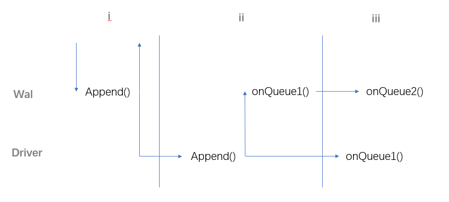
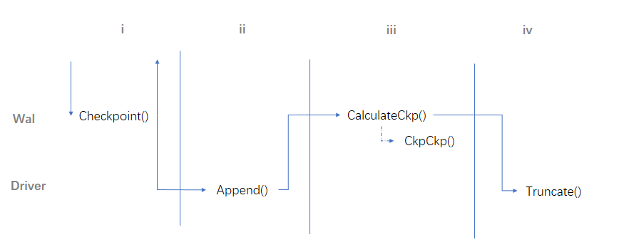

1. Wal
   
     主要功能是：计算checkpoint并通知Driver做truncate，记录checkpointed,synced,lsn。
   * FuzzyCheckpoint
  
      按照group记录所有的checkpoint信息。用closeIntervals记录完全ckp的lsn，用bitmap记录部分ckp的lsn。
   * WalDriverLsnMap
  
      Wal和Driver各自维护一套lsn，Wal的会分group，Driver是全局的。这个map记录wal的lsn和driver的lsn的对应关系。
   * WalLsnTidMap
  
      对每个属于commit group的entry，会记录wal lsn和txnID对应关系
   * DriverCheckpointed
  
      Driver的checkpoint点
   * WalCurrentLsn
  
      每个group分配出去的lsn
   * Synced
  
      每个group刷盘的lsn

2. Driver
   
     主要功能是：控制读写，比如对接logservice就会在这里攒entry。还会记录lsn和Get所需参数的对应关系。

   * lsn和addr（e.g. versionID+offset）的对应关系。
  
##
1. Append
   
   分三个阶段：
   1.  把entry放入队列，返回lsn。
       * Wal.Append():在gid-lsn中alloc并把entry传给Driver和Wal.queue1。 
   2.  entry刷盘。entry.WaitDone结束。
       * Driver.Append(): 确认持久化之后返回, 通知Wal.onQueue1()，传entry的lsn和addr给Driver.queue。
       * Wal.onQueue1():等待Driver返回，执行entry.WaitDone()，传entry给Wal.queue2。
   3.  异步地计算一些信息：各种lsn的对应关系和synced。
       * Wal.onQueue2(): 计算 Synced, WalDriverLsnMap,WalLsnTidMap。
       * Driver.onQueue1(): 计算driver lsn和addr的对应关系。

    

2. Checkpoint
   
   1. 把[]*wal.Index打包成checkpoint entry, 传给Driver
      * Wal.Checkpoint()
   1. checkpoint entry持久化。
      * Driver.Append()，和Append流程中类似。
   2. 计算FuzzyCheckpoint，清理checkpoint entry
       *  Wal.CalculateCkp(): 
           1. 计算FuzzyCheckpoint，记录checkpointEntry的DriverLsn。
  
           2. 根据FuzzyCheckpoint和WalDriverLsnMap计算Driver的checkpoint点。
  
           3. 如果最小的pending来自checkpoint entry，就清理checkpoint entry:
  
          *  Wal.CkpCkp()
              1.  生成一份checkpoint的快照
  
              2.  给Driver持久化
  
              3. checkpoint所有快照之前的checkpoint entry
   3. 传checkpoint点给Driver
      * Driver.Truncate

    
   
## Logservice Driver

### Append

1. Collect entries（preAppendQueue）
  Logservice driver会等待积攒多个entry(16kB)，打包成一个logrecord，一起append。如果entry很少，会定时刷一个flush entry，打包时间间隔内的所有entry。
2. Append entries by logservice（appendQueue）
   driver从pool里拿一个client，把logrecord交给它，做append。会检查，控制并发数量。
3. Wait Done（appendedQueue）
4. Log meta information（postAppendQueue）

logservice会维护三套lsn：driver lsn, append lsn, logservice lsn。
* driver lsn是为每个entry分配的lsn。在driver.Append()的时候分配。
* append lsn是为每个logrecord分配的lsn。append lsn是为了控制并发，在appender拿client时分配。
  * Appending
  已调用logservice.Client.append。但是还没返回的lsn。在client.append之前alloc。如果没有alloc成功，就无法拿到client。
  * Appended
  已经成功返回后记录的lsn，和appending对应。
* logservice lsn是为每个logrecord分配的lsn，由logservice分配。

### 关于并发
  在步骤2中，append是并发的。每个进入append queue的appender，调用logservice client做append后，会直接返回，不会等待结果。同时会有多个client做append。append返回的lsn不一定按照原来的顺序。
  * logservice lsn和入队顺序之差可以控制。会记录已经append成功返回的lsn（appended），和append但未返回的lsn（appending）。如果某个recordentry，在它之后又分配了很多append lsn做并发，但它一直没有append成功，就会停止之后的append并发。即，如果等待的即appended中第一个区间的end，加上a（暂时是100），不能小于append值。不满足条件，append lsn就无法分配，无法拿到新的client做并发。这样，logservice lsn离原来的顺序不会非常大，在replay的时候，可以用一个cache读到。
  * 提交顺序时串行的。步骤3中，entry的wait done是串行的。entry进入每个队列的顺序会保持一致。所以，对于每个entry，只有当它之前所有的entry都做完waitdone，这个entry才有可能成功waitdone。