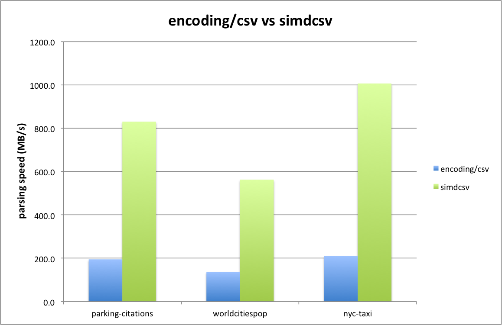

# simdcsv

## Introduction

`simdcsv` is a Golang package to accelerate parsing of CSV data. It leverages SIMD capabilities for Intel and AMD CPUs (from AVX2 onwards) to speed up the parsing process while detecting and handling the various peculiarities of the CSV data format.
 
It uses a two stage design approach which is somewhat analogous to and inspired by [simdjson-go](https://github.com/minio/simdjson-go).

## Design goals

- 1 GB/sec parsing performance
- support arbitrarily large data sets (and beyond 4 GB)
- drop-in replacement for `encoding/csv`
- zero copy behaviour and memory efficient

## Two stage design

The design of `simdcsv` consists of two stages:
- stage 1: preprocess the CSV
- stage 2: parse CSV

Fundamentally `simdcsv` works on chunks of 64 bytes at a time which are loaded into a set of 2 YMM registers. Using AVX2 instructions the presence of characters such as separators, newline delimiters and quotes are detected and merged into a single 64-bit wide register.

##  Performance compared to encoding/csv

Below is a graph showing a comparison between `encoding/csv` and `simdcsv` for a couple of popular CSV data sets. The detailed benchmarks are as follows (taken on an AWS EC2 `c5.12xlarge` instance with an Intel Cascade Lake CPU):

```
benchmark                                  old MB/s     new MB/s     speedup
BenchmarkCsv/parking-citations-100K-48     195.82        831.75      4.25x
BenchmarkCsv/worldcitiespop-100K-48        137.40        563.45      4.10x
BenchmarkCsv/nyc-taxi-data-100K-48         210.25       1007.57      4.79x
```



## Stage 1: Preprocessing stage

The main job of the first stage is to scan a chunk of data for the presence of quoted fields. 

Within quoted fields some special processing is done for:
- double quotes (`""`): these are cleared in the corresponding mask in order to prevent the second stage from treating it as either an opening or closing qoute.
- separator character: each separator character in a quoted field has its corresponding bit cleared so as to be ignored in the second stage.

In addition all CVS data is scanned for carriage return characters followed by a newline character (`\r\n` pairs):
- within quoted fields: the (`\r\n`) pair is marked as a position to be replaced with just a single newline (`\n`) during the second stage.
- everywhere else: the `\r` is marked as a newline (`\n`) so that it will be treated as an empty line during the second stage (which are ignored).

In order to be able to detect double quotes and pairs of carriage return and newlines, for the last bit (63rd) it is necessary to look ahead to the next set of 64 bytes. So the first stage reads one chunk ahead and, upon finishing the current chunk, swaps the next chunk to the current chunk and loads the next set of 64 bytes to process.

The result from the first stage is a set of three bit-masks:
- quote mask: mask indicating opening or closing quotes for quoted fields (excluding escaped quotes)
- separator mask: mask for splitting a row of CSV data into separate fields (excluding separator characters in quoted fields)
- carriage return mask: mask that indicates which carriage returns to treat as newlines

Detailed benchmarks for stage 1:

```
BenchmarkStage1/parking-citations-100K-48               134           8836499 ns/op        1498.24 MB/s
BenchmarkStage1/worldcitiespop-100K-48                  434           2751225 ns/op        1802.24 MB/s
BenchmarkStage1/nyc-taxi-data-100K-48                    49          22652981 ns/op        1464.42 MB/s
```

## Stage 2: Parsing stage

The second stage takes the (adjusted) bit masks from the first stage in order to work out the offsets of the individual fields into the buffer containing the CSV data.

To prevent needlessy copying (and allocating) strings out of buffer of CSV data, there is a single large slice of strings representing all columns for all rows in the CSV data. Each string out of the columns slice points back at the appropriate starting position in the CSV data and has the corresponding length for that particular field.

As the columns are parsed, they are added to the same row (slice of strings) until a delimiter in the form of an active bit in the newline mask is detected. Then a new row is started to which the subsequent fields will be added.

Note that empty rows are automatically eliminated. A carriage return character, immediately followed by a newline, is indicated from the first stage to be treated as a newline character. As such it properly terminates the current row while not adding an empty row to the parsed results.

For the vast majority of the fields, there is an optimized "zero-copy" memory representation whereby the field is directly pointing back into the original buffer of CSV data. However there are some fields that require post-processing in order to have the correct representation (and meeting equivalence to how `encoding/csv` operates). 

These fields are all quoted fields that contain either a double quote (escaped quote) or a carriage return and newline pair. The first stage outputs a rough indication of which fields require this post-processing and, upon completion of the second stage, a simple `string.ReplaceAll()` is invoked on these fields.

Detailed benchmarks for stage 2:

```
BenchmarkStage2/parking-citations-100K-48               100          10118645 ns/op        1308.40 MB/s
BenchmarkStage2/worldcitiespop-100K-48                  314           3785415 ns/op        1309.86 MB/s
BenchmarkStage2/nyc-taxi-data-100K-48                    44          26093220 ns/op        1271.34 MB/s
```

## Example

Below is an example that illustrates the bit masks for the different identification characters as well as their interaction between both stages.

The input data is a modified version of the example from `encoding\csv` with a couple of changes for cases that need proper handling:
 
```go
	instr := `first_name,last_name,username
"Rob","Pike",rob
Ken,Thompson,ken
"Robert","Griesemer","gri"
`

	instr = strings.Replace(instr, "\n", "\r\n", 1)                     // change regular newline into carriage return and newline pair
	instr = strings.Replace(instr, `"Rob"`, `"Ro""b"`, 1)               // pair of double quotes in quoted field that act as an escaped quote
	instr = strings.Replace(instr, `"Pike"`, `"Pi,ke"`, 1)              // separator character in quoted field that shoule be disabled
	instr = strings.Replace(instr, `"Robert"`, `"Rob`+"\r\n"+`ert"`, 1) // carriage return in quoted field followed by newline --> treated as newline
	instr = strings.Replace(instr, `"Griesemer"`, "Gries\remer", 1)     // carriage return in quoted field not followed by newline  --> not treated as newline
```

So the input data is (as shown below in hexadecimal dump) a mix of carriage return and newline lines along with normally terminated lines. Also one quoted field contains a carriage return and newline pair (which `encoding\csv` filters out to just a newline character) as well as another quoted field that contains just a carriage return character which is copied unchanged to the resulting output.

```
=== RUN   TestExample
00000000  66 69 72 73 74 5f 6e 61  6d 65 2c 6c 61 73 74 5f  |first_name,last_|
00000010  6e 61 6d 65 2c 75 73 65  72 6e 61 6d 65 0d 0a 22  |name,username.."|
00000020  52 6f 22 22 62 22 2c 22  50 69 2c 6b 65 22 2c 72  |Ro""b","Pi,ke",r|
00000030  6f 62 0a 4b 65 6e 2c 54  68 6f 6d 70 73 6f 6e 2c  |ob.Ken,Thompson,|
00000040  6b 65 6e 0a 22 52 6f 62  0d 0a 65 72 74 22 2c 47  |ken."Rob..ert",G|
00000050  72 69 65 73 0d 65 6d 65  72 2c 22 67 72 69 22 0a  |ries.emer,"gri".|
00000060  00 00 00 00 00 00 00 00  00 00 00 00 00 00 00 00  |................|
00000070  00 00 00 00 00 00 00 00  00 00 00 00 00 00 00 00  |................|
```

The first stage detects the occurrence of quotes, separator, and carriage return characters (whereby the separator character can be specified by the user). Each mask is adjusted accordingly based on the "quoted" status of a field and/or the occurrence of double quotes or carriage return and newline pairs.

Below the input and output states for each bit mask are shown. For instance, for the test CSV data shown above, the bits for the double quote pair are filtered out for the quote mask and the separator character in the quoted field is cleared for the separator mask.

(NB: The `·` (high dot) in the middle is inserted purely for illustrational purposes to make it easier to distinguish between the first and second set of 64 bytes/bits)

```
         input: first_name,last_name,username  "Ro""b","Pi,ke",rob Ken,Thompson,·ken "Rob  ert",Gries emer,"gri" 
     quote-in : 0000000000000000000000000000000100110101000001000000000000000000·0000100000000100000000000010001000000000000000000000000000000000
     quote-out: 0000000000000000000000000000000100000101000001000000000000000000·0000100000000100000000000010001000000000000000000000000000000000
                                                  ^^                                                                                             
 separator-in : 0000000000100000000010000000000000000010001000100000001000000001·0000000000000010000000000100000000000000000000000000000000000000
 separator-out: 0000000000100000000010000000000000000010000000100000001000000001·0000000000000010000000000100000000000000000000000000000000000000
                                                          ^                                                                                      
  carriage-in : 0000000000000000000000000000010000000000000000000000000000000000·0000000010000000000010000000000000000000000000000000000000000000
  carriage-out: 0000000000000000000000000000010000000000000000000000000000000000·0000000000000000000000000000000000000000000000000000000000000000
                                                                                         ^           ^                                           
```

The bit masks for the quotes and the separators are passed directly to the second stage. The delimiter mask is the OR of the carriage return mask shown above in combination with the mask of newline characters from the original data.

```
        quotes: 0000000000000000000000000000000100000101000001000000000000000000·0000100000000100000000000010001000000000000000000000000000000000
     delimiter: 0000000000000000000000000000011000000000000000000010000000000000·0001000001000000000000000000000100000000000000000000000000000000
     separator: 0000000000100000000010000000000000000010000000100000001000000001·0000000000000010000000000100000000000000000000000000000000000000
         input: first_name,last_name,username  "Ro""b","Pi,ke",rob Ken,Thompson,·ken "Rob  ert",Gries emer,"gri" 
        row[0]: first_name last_name username                                   ·                                                                
        row[1]:                                 Ro""b   Pi,ke  rob              ·                                                                
        row[2]:                                                    Ken Thompson ·ken                                                             
        row[3]:                                                                 ·     Rob  ert  Gries emer  gri                                  
```

Based on the separator, delimiter and quote masks, the second stage works out where each field of each row starts (and ends) by pointing directly back into the original buffer. In case the field is quoted, both quotes are skipped, so effectively the content starts one position later and ends one position earlier.
 
For the vast majority of fields this immediately yields the desired result, except for quoted fields that contain either escaped quotes (see `Ro""b"` above) or a carriage return and newline pair that should be replaced with a newline character only (see `Rob  ert` above).

As such there is a final (small) postprocessing step that does a `strings.ReplaceAll()` for just the affected fields in order to make this correction. So only for these fields additional memory needs to be allocated and the behaviour is not "zero-copy". In case the CSV does not contain any fields that need this transformation, this step is effectively skipped (and note that the step is typically only applied to a small number of fields, so the performance overhead is normally very low).

The table below shows the adjusted fields that are merged back into the overall results shown above.

```
        row[1]:                                 Ro"b                            ·                                                                
        row[3]:                                                                 ·     Rob ert                                                    
```

This then gives us the slice of slices of strings (`[][]string`) which contains the results of the `ReadAll()` operation.

The test code for this example is generated by the function `TestExample()` in `simdcsv_test.go`. So it is actually possible to modify the input data and see what the effects are on the individual masks and final result. Note that this code is for illustration purposes only as it just works up to CSV data of max. 128 characters (and is not performance optimized).  

## Development

For the algorithms of both stages, `simdcsv` contains both Golang code as well as assembly (which is semi-autogenerated, see below). 

The main loop for both stages follows the same pattern in the sense that it take several bitmasks as input and figures out in which bitmask the first bit is set. This then indicates that such a character is the first character to be handled. The following pseudo code shows the idea:

```go
	separatorPos := bits.TrailingZeros64(separatorMaskIn)
	carriageReturnPos := bits.TrailingZeros64(carriageReturnMaskIn)
	quotePos := bits.TrailingZeros64(quoteMaskIn)

	for {
		if quotePos < separatorPos && quotePos < carriageReturnPos {
			// do stuff 
			quoteMaskIn &= clearMask << quotePos
			quotePos = bits.TrailingZeros64(quoteMaskIn)

		} else if separatorPos < quotePos && separatorPos < carriageReturnPos {
			// do stuff 
			separatorMaskIn &= clearMask << separatorPos
			separatorPos = bits.TrailingZeros64(separatorMaskIn)

		} else if carriageReturnPos < quotePos && carriageReturnPos < separatorPos {
			// do stuff 
			carriageReturnMaskIn &= clearMask << carriageReturnPos
			carriageReturnPos = bits.TrailingZeros64(carriageReturnMaskIn)

		} else {
			// we must be done
			break
		}
	}
```

Note that this algorithm would not work correctly if two or more masks would have a bit set in the same position, but since we know that will never be the case, it is safe to assume this.

In order to get the assembly, we take advantage of the Golang compiler and extract the generated assembly using the `go tool objdump` as follows:

```
$ go test -c 
$ go tool objdump -s preprocessMasks simdcsv.test
TEXT github.com/fwessels/simdcsv.preprocessMasks(SB) golang/src/github.com/fwessels/simdcsv/stage1-preprocessing.go
  stage1-preprocessing.go:38    0x1104670               4883ec08                SUBQ $0x8, SP                   
  stage1-preprocessing.go:38    0x1104674               48892c24                MOVQ BP, 0(SP)                  
  stage1-preprocessing.go:38    0x1104678               488d2c24                LEAQ 0(SP), BP                  
  stage1-preprocessing.go:42    0x110467c               488b442410              MOVQ 0x10(SP), AX               
  ...
  ...
  ...
  stage1-preprocessing.go:104   0x1104910               4889f9                  MOVQ DI, CX                     
  stage1-preprocessing.go:98    0x1104913               ebad                    JMP 0x11048c2                   
  stage1-preprocessing.go:113   0x1104915               488b2c24                MOVQ 0(SP), BP                  
  stage1-preprocessing.go:113   0x1104919               4883c408                ADDQ $0x8, SP                   
  stage1-preprocessing.go:113   0x110491d               c3                      RET                             
  stage1-preprocessing.go:104   0x110491e               e81d69f2ff              CALL runtime.panicshift(SB)     
  stage1-preprocessing.go:65    0x1104946               e8f568f2ff              CALL runtime.panicshift(SB)     
  stage1-preprocessing.go:65    0x110494b               90                      NOPL                            
  :-1                           0x110494f               cc                      INT $0x3     
```

It then takes a bit of massaging and editing to get the extracted Golang (Plan9) assembly to compile. For instance, the absolute addresses in JMP instructions are replaced with labels, the `runtime.panicshift` calls are eliminated since it is made sure that the routine is never called with arguments that can lead to reading beyond the limits of the input slices (eg. the input buffer), etc.

To verify that the Golang code and the extracted assembly routine work identically, all test cases for both stages are tested twice, once for the (high-level) Golang code, and once for the assembly equivalent, as per the following code:

```go
func TestStage1PreprocessMasks(t *testing.T) {
	t.Run("go", func(t *testing.T) {
		testStage1PreprocessMasksFunc(t, preprocessMasks)
	})
	t.Run("avx2", func(t *testing.T) {
		testStage1PreprocessMasksFunc(t, stage1_preprocess_test)
	})
}
```

## Limitations

`simdcsv` has the following limitations:
- Optimized for AVX2 on Intel and AMD
- `LazyQuotes` is not supported (fallback to `encoding/csv`)
- Non-ASCII characters for either Comma or Comment are not supported (fallback to `encoding/csv`)

## License

`simdcsv` is released under the Apache License v2.0. You can find the complete text in the file LICENSE.

## Contributing

Contributions are welcome, please send PRs for any enhancements.

## References

Ge, Chang and Li, Yinan and Eilebrecht, Eric and Chandramouli, Badrish and Kossmann, Donald, [Speculative Distributed CSV Data Parsing for Big Data Analytics](https://www.microsoft.com/en-us/research/publication/speculative-distributed-csv-data-parsing-for-big-data-analytics/), SIGMOD 2019.

[Awesome Comma-Separated Values](https://github.com/csvspecs/awesome-csv)

