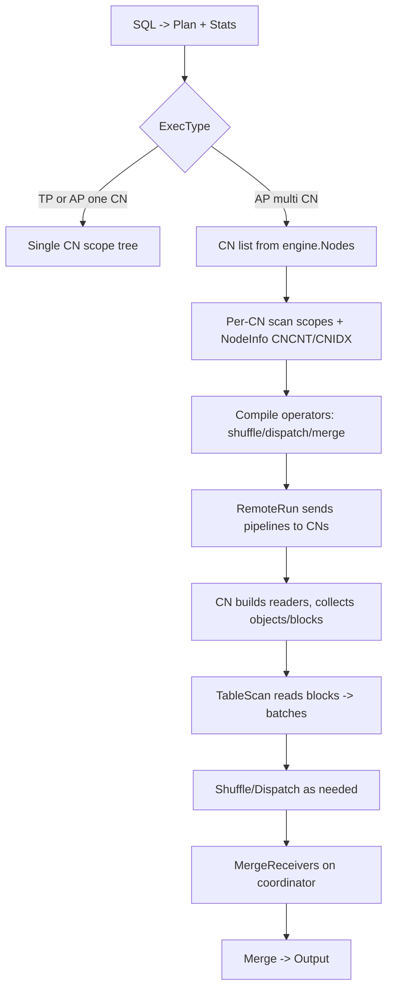

# AP Multi-CN Scan, Shuffle, and Merge Guide

Version: upstream/main commit c3b10c30a7fa38c030733eba487d36a060c16623

This guide explains how an AP query is planned and executed across multiple CNs, how each CN collects objects/blocks, and how results are merged. It reflects the current implementation in this repo.

-------------------------------------------------------------------------------
Part 1. Overall Flow (with diagram)
-------------------------------------------------------------------------------

High-level flow:
1) Planner produces a physical plan and statistics.
2) Compile decides AP execution mode (TP, AP one CN, or AP multi CN).
3) Compile builds per-CN scopes for scans and inserts shuffle/dispatch/merge operators.
4) Runtime sends remote scopes to other CNs; each CN collects its object/block list and scans.
5) Remote CNs stream batches back; the coordinator merges and returns the final result.

Flow diagram (compile + runtime):

-------------------------------------------------------------------------------
Part 2. Step-by-step Details
-------------------------------------------------------------------------------

Step 1: Decide AP multi-CN during planning
- The planner fills node statistics (rows, blocks, cost, etc.).
- `plan.GetExecType` decides the execution mode using thresholds and flags.
  - `ForceScanOnMultiCN` forces AP multi-CN.
  - Large scan cost/blocks switch to AP (one CN or multi-CN).
- File: `pkg/sql/plan/stats.go`.

Step 2: Build the CN list and execution scopes in compile
- `compileQuery` decides `execType`, then builds `cnList`.
  - TP or AP one CN uses only the local CN.
  - AP multi-CN uses `engine.Nodes()` plus availability checks.
- `CalcQueryDOP` sets per-node DOP based on stats and CN count.
- Files: `pkg/sql/compile/compile.go`, `pkg/sql/plan/stats.go`.

Step 3: Table scan scopes per CN
- `compileTableScan` calls `generateNodes` to decide which CNs scan the table.
  - `shouldScanOnCurrentCN` keeps scans local for small tables or force-single cases.
  - Otherwise, each CN gets a `NodeInfo` with `CNCNT` and `CNIDX`.
- For remote CNs, compile attaches tombstones to `NodeInfo.Data` so remote scans can filter deletes.
- Files: `pkg/sql/compile/compile.go`.

Step 4: RemoteRun wiring and merge scaffolding
- Each scope has a root operator; compile adds `connector` and `merge` operators when multiple scopes are combined.
- `newMergeScope` creates MergeReceivers and connects child scopes to the merge operator.
- For remote CNs, `Scope.RemoteRun` encodes and sends the pipeline; the server rebuilds a compile and runs it.
- Files: `pkg/sql/compile/compile.go`, `pkg/sql/compile/scope.go`, `pkg/sql/compile/remoterun*.go`.

Step 5: Runtime reader construction and object/block collection
- `Scope.buildReaders` is the runtime entry for scan preparation.
  - It waits for runtime filters, applies them, then calls `getRelData`.
- `getRelData` uses `expandRanges` to call `rel.Ranges` with a `RangesParam`:
  - `Policy` decides committed/uncommitted coverage.
  - `Rsp` (`RangesShuffleParam`) carries CN count/index and shuffle ranges.
- `rel.Ranges` uses `readutil.FilterObjects`, which applies `ShouldSkipObjByShuffle`:
  - Range shuffle uses sort-key zone maps.
  - Hash shuffle uses object ID hashing.
  - Appendable objects are kept on the local CN.
- Current behavior in multi-CN mode:
  - Local CN: `Policy_CollectAllData` with shuffle param.
  - Remote CN: `Policy_CollectCommittedPersistedData` with shuffle param, then attach tombstones from coordinator.
- Files: `pkg/sql/compile/scope.go`, `pkg/sql/compile/compile.go`,
  `pkg/sql/plan/shuffle.go`, `pkg/vm/engine/readutil/exec_util.go`,
  `pkg/vm/engine/types.go`.

Step 6: TableScan execution on each CN
- `table_scan.TableScan` reads from a Reader built with the RelData list.
- Each Reader streams blocks into batches and applies remaining filters.
- File: `pkg/sql/colexec/table_scan/table_scan.go`.

Step 7: Shuffle and dispatch during runtime (joins/aggregations)
- When a plan node requires shuffle, compile constructs shuffle operators:
  - `shuffle` or `shuffleV2` for data redistribution.
  - `shufflebuild` for join build-side runtime filtering.
- `dispatch` sends batches to local or remote receivers based on shuffle index.
- Files: `pkg/sql/compile/operator.go`, `pkg/sql/compile/compile.go`,
  `pkg/sql/colexec/shuffle`, `pkg/sql/colexec/shuffleV2`, `pkg/sql/colexec/dispatch`.

Step 8: Merge results and return to client
- Remote CNs send batches back via the RemoteRun RPC stream.
- On the coordinator, `MergeReceiver` channels feed the `merge` operator.
- The root `output` operator writes the final result to the client.
- Files: `pkg/sql/compile/remoterunClient.go`, `pkg/sql/compile/remoterunServer.go`,
  `pkg/sql/colexec/merge`, `pkg/sql/colexec/connector`, `pkg/sql/colexec/output`.

-------------------------------------------------------------------------------
Part 3. Important Functions and Files
-------------------------------------------------------------------------------

Compile and plan selection
- `pkg/sql/plan/stats.go`: `GetExecType`, `CalcQueryDOP`, multi-CN thresholds and flags.
- `pkg/sql/compile/compile.go`: `compileQuery`, `getCNList`, `removeUnavailableCN`.

Multi-CN scan construction
- `pkg/sql/compile/compile.go`: `compileTableScan`, `generateNodes`, `shouldScanOnCurrentCN`.
- `pkg/sql/compile/compile.go`: `newMergeScope`, `newMergeScopeByCN`, `mergeScopesByCN`.

Object/block collection and shuffle
- `pkg/sql/compile/scope.go`: `getRelData`, `buildReaders`.
- `pkg/sql/compile/compile.go`: `expandRanges` (wraps `rel.Ranges`).
- `pkg/sql/plan/shuffle.go`: `ShouldSkipObjByShuffle`, `CalcRangeShuffleIDXForObj`.
- `pkg/vm/engine/readutil/exec_util.go`: `FilterObjects` (applies shuffle skip).
- `pkg/vm/engine/types.go`: `RangesParam`, `RangesShuffleParam`, `DataCollectPolicy`.

Remote execution and merge
- `pkg/sql/compile/scope.go`: `RemoteRun`, `MergeRun`.
- `pkg/sql/compile/remoterunClient.go`: `remoteRun`, `prepareRemoteRunSendingData`.
- `pkg/sql/compile/remoterunServer.go`: `CnServerMessageHandler`, `handlePipelineMessage`.
- `pkg/sql/colexec/merge` and `pkg/sql/colexec/connector`: merge/connector operators.
- `pkg/sql/colexec/dispatch`: shuffle dispatch to local/remote receivers.

Additional reference
- `pkg/sql/compile/Remote_Run_DEV_GUIDE.md`: remote-run protocol and pipeline encoding details.
